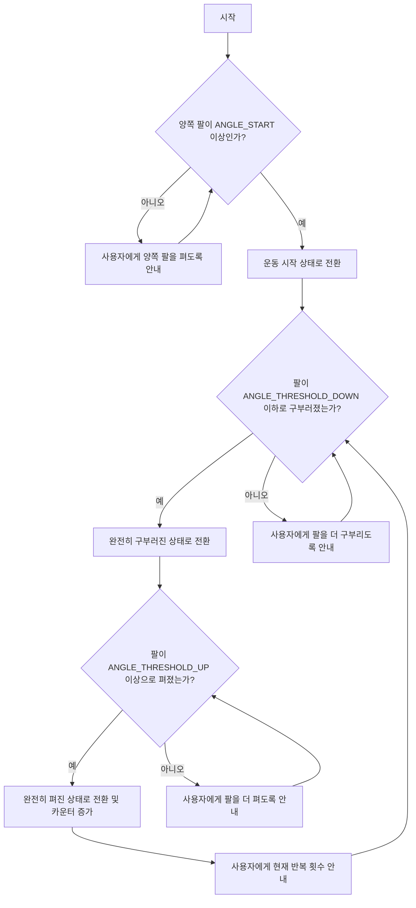
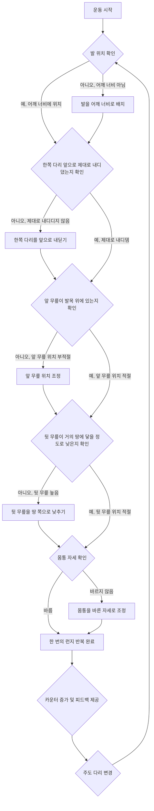
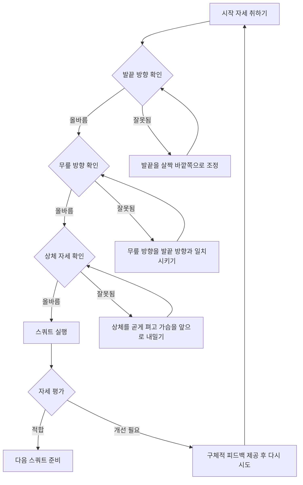
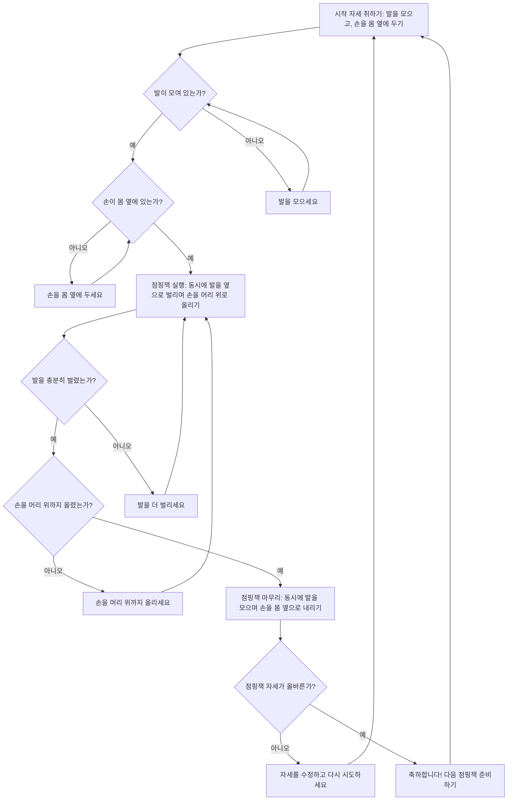

## PushUp

```mermaid
flowchart TD
    A[시작] --> B{양쪽 팔이 ANGLE_START 이상인가?}
    B -->|아니오| C[사용자에게 양쪽 팔을 펴도록 안내]
    C --> B
    B -->|예| D[운동 시작 상태로 전환]
    D --> E{팔이 ANGLE_THRESHOLD_DOWN 이하로 구부러졌는가?}
    E -->|예| F[완전히 구부러진 상태로 전환]
    E -->|아니오| G[사용자에게 팔을 더 구부리도록 안내]
    G --> E
    F --> H{팔이 ANGLE_THRESHOLD_UP 이상으로 펴졌는가?}
    H -->|예| I[완전히 펴진 상태로 전환 및 카운터 증가]
    H -->|아니오| J[사용자에게 팔을 더 펴도록 안내]
    J --> H
    I --> K[사용자에게 현재 반복 횟수 안내]
    K --> E
```
## Lunge

```mermaid
flowchart TD
    A[운동 시작] --> B{발 위치 확인}
    B -->|아니오, 어깨 너비 아님| I[발을 어깨 너비로 배치]
    B -->|예, 어깨 너비에 위치| C{한쪽 다리 앞으로 제대로 내디뎠는지 확인}
    I --> C
    C -->|아니오, 제대로 내디디지 않음| J[한쪽 다리를 앞으로 내딛기]
    J --> D
    C -->|예, 제대로 내디뎀| D{앞 무릎이 발목 위에 있는지 확인}
    D -->|아니오, 앞 무릎 위치 부적절| K[앞 무릎 위치 조정]
    K --> E
    D -->|예, 앞 무릎 위치 적절| E{뒷 무릎이 거의 땅에 닿을 정도로 낮은지 확인}
    E -->|아니오, 뒷 무릎 높음| L[뒷 무릎을 땅 쪽으로 낮추기]
    L --> F
    E -->|예, 뒷 무릎 위치 적절| F{몸통 자세 확인}
    F -->|바르지 않음| M[몸통을 바른 자세로 조정]
    F -->|바름| G[한 번의 런지 반복 완료]
    M --> G
    G --> H{카운터 증가 및 피드백 제공}
    H --> N{주도 다리 변경}
    N --> B
```

## Squat

```mermaid
flowchart TD
    A[시작 자세 취하기] --> B{발끝 방향 확인}
    B -->|올바름| C{무릎 방향 확인}
    B -->|잘못됨| D[발끝을 살짝 바깥쪽으로 조정]
    D --> B
    C -->|올바름| E{상체 자세 확인}
    C -->|잘못됨| F[무릎 방향을 발끝 방향과 일치시키기]
    F --> C
    E -->|올바름| G[스쿼트 실행]
    E -->|잘못됨| H[상체를 곧게 펴고 가슴을 앞으로 내밀기]
    H --> E
    G --> I{자세 평가}
    I -->|적합| J[다음 스쿼트 준비]
    I -->|개선 필요| K[구체적 피드백 제공 후 다시 시도]
    K --> A
```

##Jumping Jack

```mermaid
flowchart TB
    A[시작 자세 취하기: 발을 모으고, 손을 몸 옆에 두기] --> B{발이 모여 있는가?}
    B -- 예 --> C{손이 몸 옆에 있는가?}
    B -- 아니오 --> D[발을 모으세요]
    D --> B
    C -- 아니오 --> E[손을 몸 옆에 두세요]
    C -- 예 --> F[점핑잭 실행: 동시에 발을 옆으로 벌리며 손을 머리 위로 올리기]
    E --> C
    F --> G{발을 충분히 벌렸는가?}
    G -- 예 --> H{손을 머리 위까지 올렸는가?}
    G -- 아니오 --> I[발을 더 벌리세요]
    I --> F
    H -- 아니오 --> J[손을 머리 위까지 올리세요]
    H -- 예 --> K[점핑잭 마무리: 동시에 발을 모으며 손을 몸 옆으로 내리기]
    J --> F
    K --> L{점핑잭 자세가 올바른가?}
    L -- 아니오 --> M[자세를 수정하고 다시 시도하세요]
    L -- 예 --> N[축하합니다! 다음 점핑잭 준비하기]
    M --> A
    N --> A
```

