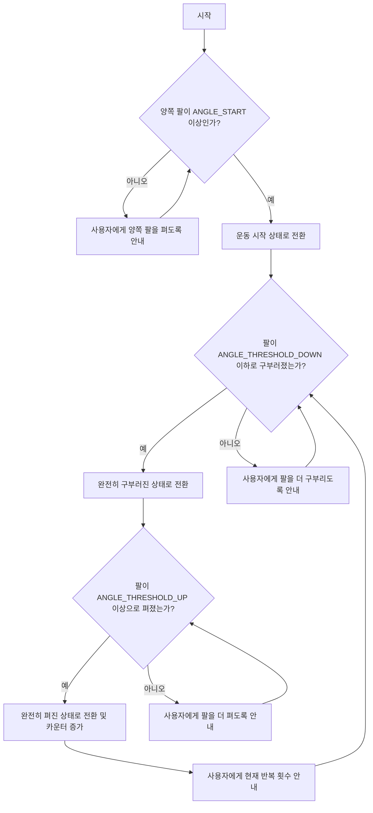
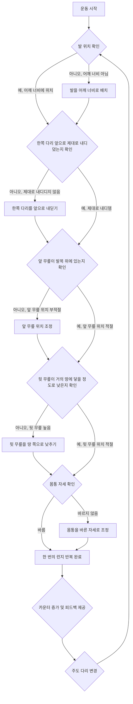

## PushUp

```mermaid
flowchart TD
    A[시작] --> B{양쪽 팔이 ANGLE_START 이상인가?}
    B -->|아니오| C[사용자에게 양쪽 팔을 펴도록 안내]
    C --> B
    B -->|예| D[운동 시작 상태로 전환]
    D --> E{팔이 ANGLE_THRESHOLD_DOWN 이하로 구부러졌는가?}
    E -->|예| F[완전히 구부러진 상태로 전환]
    E -->|아니오| G[사용자에게 팔을 더 구부리도록 안내]
    G --> E
    F --> H{팔이 ANGLE_THRESHOLD_UP 이상으로 펴졌는가?}
    H -->|예| I[완전히 펴진 상태로 전환 및 카운터 증가]
    H -->|아니오| J[사용자에게 팔을 더 펴도록 안내]
    J --> H
    I --> K[사용자에게 현재 반복 횟수 안내]
    K --> E
```
## Lunge

```mermaid
flowchart TD
    A[운동 시작] --> B{발 위치 확인}
    B -->|아니오, 어깨 너비 아님| I[발을 어깨 너비로 배치]
    B -->|예, 어깨 너비에 위치| C{한쪽 다리 앞으로 제대로 내디뎠는지 확인}
    I --> C
    C -->|아니오, 제대로 내디디지 않음| J[한쪽 다리를 앞으로 내딛기]
    J --> D
    C -->|예, 제대로 내디뎀| D{앞 무릎이 발목 위에 있는지 확인}
    D -->|아니오, 앞 무릎 위치 부적절| K[앞 무릎 위치 조정]
    K --> E
    D -->|예, 앞 무릎 위치 적절| E{뒷 무릎이 거의 땅에 닿을 정도로 낮은지 확인}
    E -->|아니오, 뒷 무릎 높음| L[뒷 무릎을 땅 쪽으로 낮추기]
    L --> F
    E -->|예, 뒷 무릎 위치 적절| F{몸통 자세 확인}
    F -->|바르지 않음| M[몸통을 바른 자세로 조정]
    F -->|바름| G[한 번의 런지 반복 완료]
    M --> G
    G --> H{카운터 증가 및 피드백 제공}
    H --> N{주도 다리 변경}
    N --> B
```
