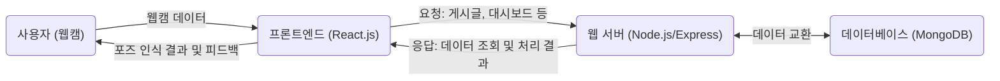

# grad

```mermaid
graph LR
    A("사용자 (웹캠)") -->|웹캠 데이터| B("프론트엔드 (React.js)")
    B -->|포즈 인식 결과 및 피드백| A
    B -->|요청: 게시글, 대시보드 등| C("웹 서버 (Node.js/Express)")
    C -->|응답: 데이터 조회 및 처리 결과| B
    C <-->|데이터 교환| D("데이터베이스 (MongoDB)")

```
